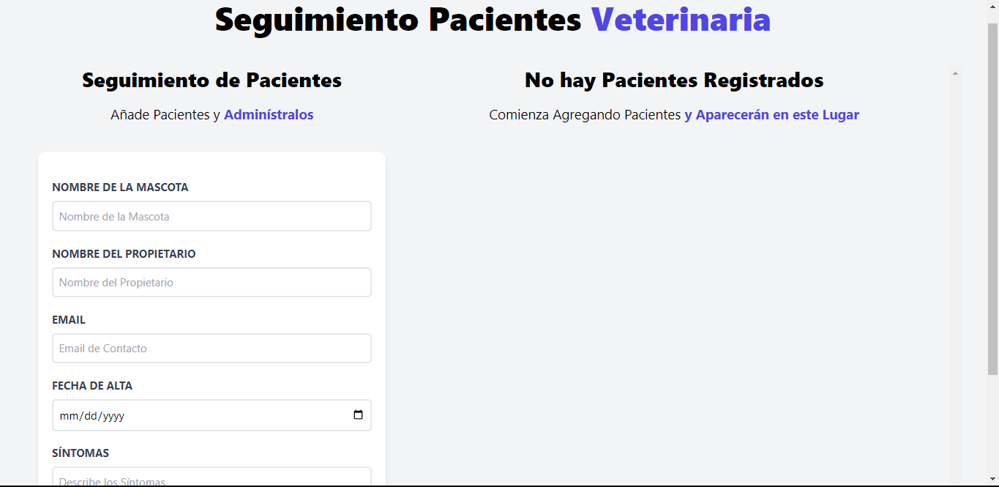
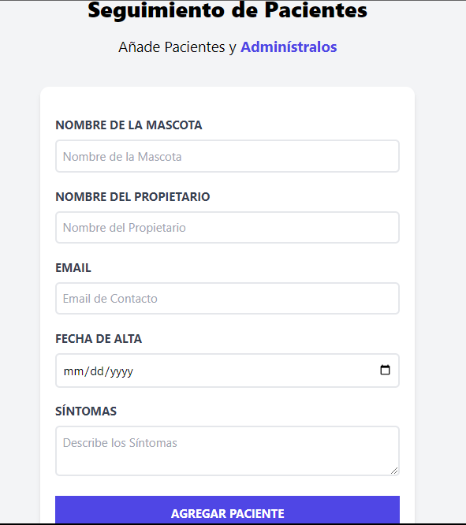
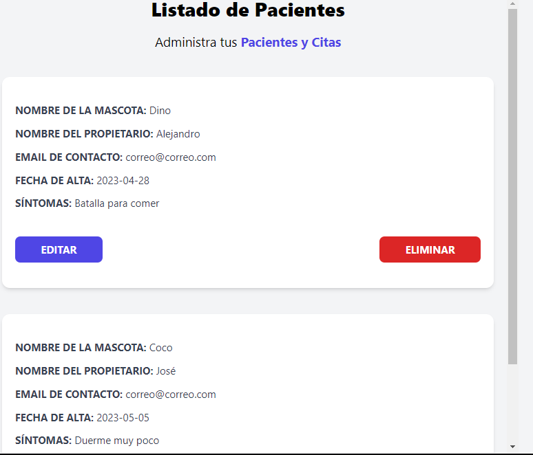

# Registro de pacientes (mascotas) de una Veterinaria

## Descripción

Este proyecto es una aplicación web que permite registrar pacientes (mascotas) de una veterinaria. La aplicación permite registrar, editar, eliminar y listar pacientes.

La aplicación cuenta con local storage para almacenar los datos de los pacientes. Es decir, los datos no se pierden al recargar la página.

## Tecnologías

- React
- Vite
- TailwindCSS
- JavaScript

## Imágenes

### Pantalla principal

### Formulario de registro

### Lista de pacientes

